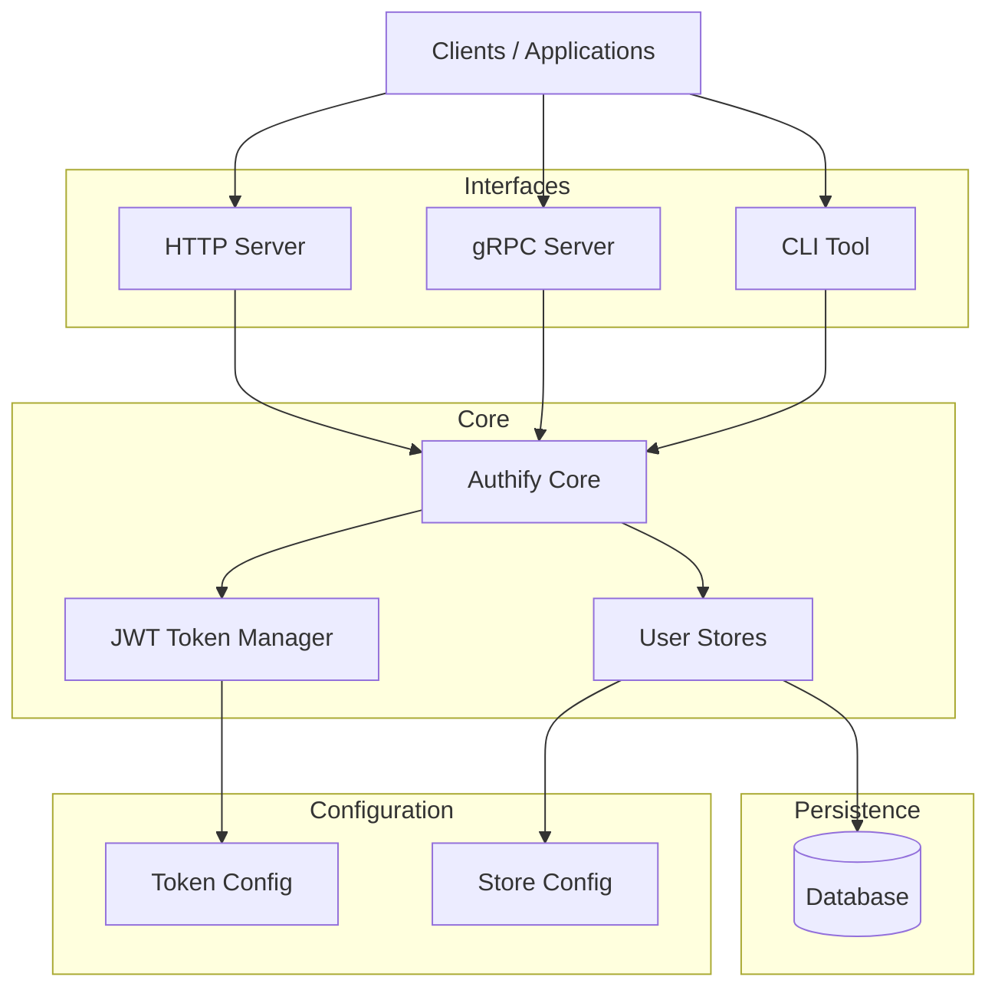

# Authify

Authify is a lightweight authentication and authorization service written in Go. It provides endpoints and libraries to create users, generate tokens, verify tokens, and refresh tokens. The project is designed to be reusable across future applications that need a simple, secure, and configurable authentication layer.



Authify can be used in two ways:

* **As a standalone authentication microservice**
* **As an embedded Go library inside your applications**

It provides a flexible JWT-based authentication system with configurable claims, multiple runtime adapters, and container-ready deployment.

---

## Features

* JWT-based authentication
* Access and refresh token support
* Configurable claim sources (database, request, or system)
* Pluggable user stores
* Refresh token rotation
* Automatic claim propagation during refresh
* Configurable token durations
* Simple middleware integration
* HTTP and gRPC server support
* CLI interface
* Container-ready deployment
* Designed to be embedded as a Go library

---

## High-Level Overview

Authify separates authentication concerns into independent components:

* **User store** – manages users and credentials
* **JWT manager** – handles token generation, verification, and refresh
* **Configuration system** – defines claim sources and token policies
* **Adapters** – expose authentication functionality via HTTP, gRPC, or CLI

This design allows Authify to act as both a reusable library and a deployable authentication service.

---

## Installation

### As a Go Library

Install using Go modules:

```bash
go get [github.com/HassanAli101/authify](https://github.com/HassanAli101/authify)
```
Import it in your project:

```bash
import "[github.com/HassanAli101/authify](https://github.com/HassanAli101/authify)"
```

### Running Authify as a (http) Service

Authify can be deployed as a standalone authentication service.

### 1. Build the binary

```
go build -o authify-server ./cmd/server
```

### 2. Run the server:

```
./authify-server
```

The server exposes endpoints for user creation, token generation, token verification, and token refresh.

```
/create-user
/generate-token 
/verify-token
/refresh-token
```

remember to send your params as headers with the prefix `authify-` and then the field name. for example: "authify-username: user123"   

## Running with Docker

Authify includes a production-ready container image.

### 1. Build the image
```
docker build -t authify .
```

### 2. Prepare configuration

Create a .env file:

```
DATABASE_URL=
JWT_SECRET=
JWT_REFRESH_SECRET=
SERVER_PORT=8080
STORE_CONFIG_FILE_PATH=/configs/store.yml
TOKEN_CONFIG_FILE_PATH=/configs/token.yml
```

Place your configuration files inside a directory such as configs/. and then assuming your config files for stores and token are named similar to the given example, the above example can be used as values to environment variables.

### 3. Run the container

```bash
docker run \
-p 8080:8080 \
-v $(pwd)/configs:/configs \
--env-file .env \
authify
```

The service will start on: http://localhost:8080

**Note:** remember to update the command's port forwarding part with the port you provided in the env file. Furthermore, the -v attaches the volume and it assumes your current directory has a `configs` folder with the config files as mentioned above and it has a .env file with all the relevant variables.

## Using Authify as a Go Library

Authify can be embedded directly into your application.

### Example initialization:

```
package main

import (
    "github.com/HassanAli101/authify"
)

func main() {
    store := // initialize store 
    jwtManager := // initialize token manager 

    a := authify.NewAuthify(store, jwtManager)

    // use a.Store and a.Tokens inside your application
}
```

This allows your application to manage users and authentication without running a separate service.

## Token Workflow

Authify supports a standard authentication lifecycle:

  1. **User Creation:** A user is created through the configured user store.

  2. **Access Token Generation:** The user authenticates using credentials, and an access token is generated.

  3. **Token Verification:** Applications verify tokens to authenticate incoming requests.

  4. **Token Refresh:** When an access token expires, a refresh token can be used to generate a new one. Authify automatically preserves and rebuilds claims during the refresh process.

## Configuration

Authify behavior is controlled through configuration files. Two configuration files are required:

  - **Store configuration** – defines user storage and database connection

  - **Token configuration** – defines JWT policies and claim sources

Example configuration files are available in `config-examples/.` These demonstrate how to configure:

  - Database connections

  - Claim sources

  - Token lifetimes

  - Refresh policies

## Important Project Components

While the repository contains multiple packages, several components form the core of Authify:

  - authify.go: Defines the main Authify struct and initialization logic that connects the user store and token manager.

  - authify_test.go: Contains integration-style tests that validate the full authentication flow.

  - token/: Handles all JWT-related functionality, including access/refresh token generation, verification, and claim construction.

  - stores/: Provides pluggable user storage backends. Stores manage user creation, credential validation, and retrieving user attributes for claims.

  - cmd/: Contains entrypoints for running Authify in different modes (HTTP server, gRPC server, CLI).

  - lib/: Library helpers and shared utilities used by multiple components.

  - proto/: gRPC service definitions and generated code.

  - config-examples/: Reference configuration files.

  - Dockerfile: Defines the container build used to run Authify in production.

## Future Direction

Authify is intended to grow into a reusable authentication layer for multiple applications. and become an open source competitor to services like AWS cognito. We have a long way to go, But I'm willing to work on this to achieve the goal.

**Author:** Created and maintained by Hassan Ali.